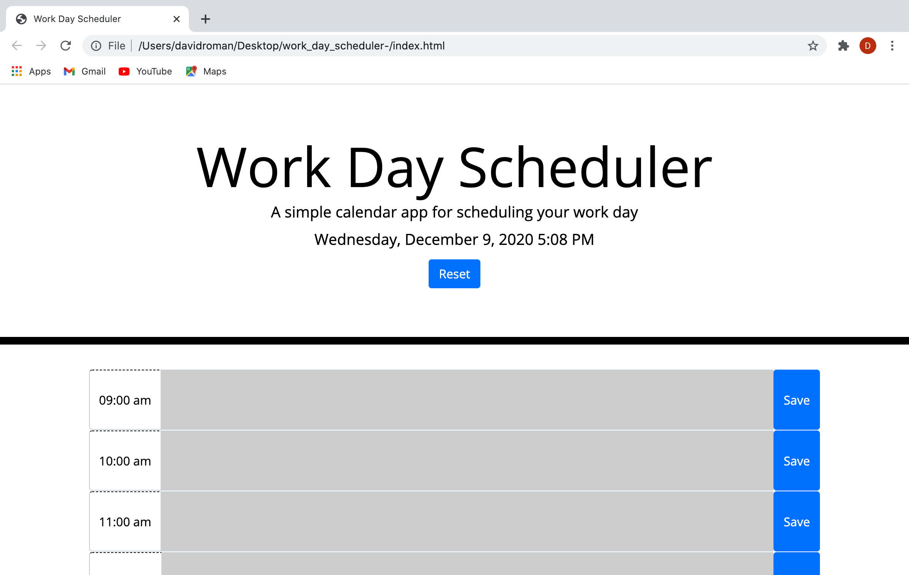

# Work Day Scheduler
This is a calendar application that allows a user to save events for each hour of the day by modifying starter code. This app will run in the browser and feature dynamically updated HTML and CSS powered by jQuery. I used a library called Moment to retrieve time and date. 

I used local storage to store and access data from the browser. Data will be displayed in the time slots that the user selected and wont reset unless the user clicks on the reset button. 

Work day scheduler homepage
